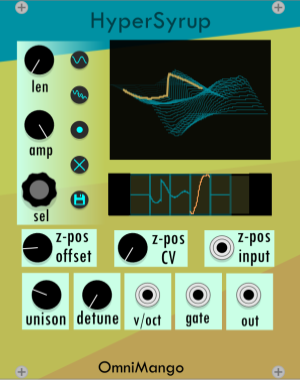
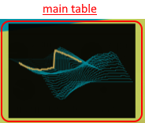
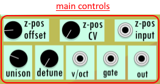
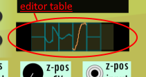
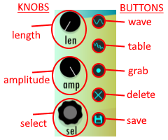
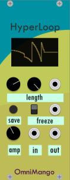

# Omnimango Hyper Series Manual
## Hello from the Author!
Hello to everyone who is taking the time to read this manual! These are a collection of plugins I developed over summer while taking a breather from gaining infinate debt in college. Whoever you are, I truly appreciate your interest. If you happen to know someone who is hiring audio plugin developers PLEASE help me get in contact (its my dream job :D). I did my absolute best to work out any potential bugs prior to release, however If you happen to experience any bugs, absolutely feel free to start a discussion on this GitHub repos issues tab. Otherwise, enjoy my plugin, thanks! -Garnet Grimm 

## HyperSyrup

### Main Table

This table displays the general waveform constructed by the currently loaded waves.
#### Controls

* **z-pos** - select the tables current position in the z-axis
* **z-pos CV** - control how much the z-pos input will affect the overall position of the table in the z-axis
* **z-pos-input** - voltage control for the position of the table in the z-axis
* **unison** - how many oscillators are currently being used to play back the waveform. 
	* *WARNING: watch CPU% when using this*
* **detune** - how out of tune each oscillator allowed to be in relation to the main oscillator
* **v/oct** - polyphonic pitch control
* **gate** - polyphonic gate control
* **out** - monophonic output
### Editor Table

The editor table shows each wave in the table laid horizontally to make for easy manipulation. The controls for the table editor are listed below.
#### Controls

* **Select** - select a wave and subsequent transition frames from the editor table
* **Amplitude** - control the amplitude of the currently selected wave and subsequent transition frames
* **Length** -control the number of transition frames from the currently selected wave to the next wave in the editor
* **Wave** - open a single wav file and add it to the wave table.
* **Table** - open an entire previous table configuration into the wave table. This is compatible with wavetables the popular synth design plugin Serum.
* **Grab** - grab a selected wave from the editor table and move it to a new location.
* **Delete** - remove the selected wave
* **Save** - save the current wave table configuration as a wav table

## Hyperloop

This module listens to incoming audio data and loops the last few milliseconds on command.
* **length** - choose how long the loop should be
* **loop** - continuously loop the previous number of seconds specified by the length parameter until release. 
* **in** - incoming audio
* **out** - outgoing (potentially looped) audio