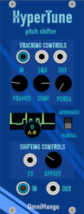
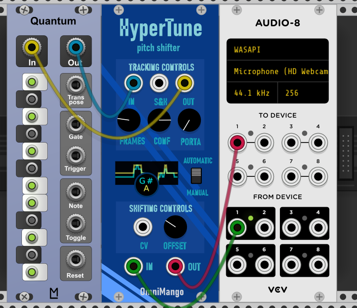
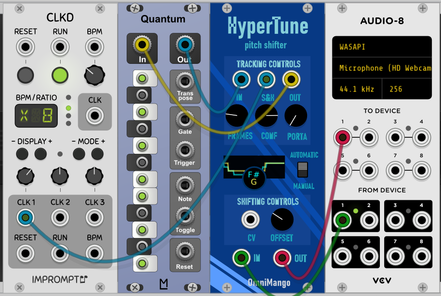
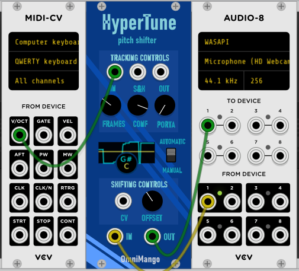

# Omnimango HyperTune
HyperTune is my best attempt at a CPU friendly Autotune like algorithm for VCV rack using the YIN pitch detection algorithm and delay based pitch shifting. I've had a lot of fun playing with this so far. It seems to work very well for any VCO, isolated vocals, guitar notes, and even guitar chords. 

  

This module listens to incoming audio data and can automatically detect the pitch. Using this information, the audio data shifted to another frequency. 

## Manual VS Automatic
In the manual mode, the pitch of all incoming data is offset by a specified amount. In automatic mode, a target frequency is specified and then attained as best as possible. 

## Tracking Controls (automatic mode controls)
* **in** - Target pitch for the incoming audio data. The audio data will then have it pitch modified to reach the target pitch. 
* **s&h** - If there is a wire connected to S&H, the target pitch will only be updated with each trigger event.
* **out** - This is the pitch detected from the incoming audio data is converted to v/oct and reported here.
* **frames** - The number of past frames to use in the pitch calculation
* **confidence** - The reported pitch of the incoming audio data will only be changed if the confidence threshold controlled by this knob is met. A value of 0.7 for example would mean the pitch tracking will only update the detected pitch if it was 70% confident.
* **porta** - Controls how fast the detected pitch is able to be modified. Under the hood this translates to a weighted average in which the most recently detected pitch information is multiplied by the porta amount. 
## Shifting Controls (manual mode controls)
* **offset** - Amount to offset the pitch of the incoming audio data
* **cv** - Amount to offset the offset

# Recommended Configurations
The first configuration I like to use changes the pitch as smoothly as possible. 
  

The second one, like the first changes the pitch but more "robotically" using S&H like the classic autotune sound.
  

This last setup is almost like a vocoder, in that you can actually play the notes that you'd like to retune to. While my plugin is monophonic, the CPU usage is low enough that the module can be duplicated several times for multiple voices. 
  